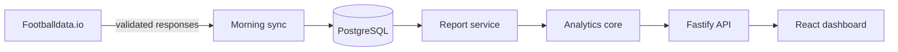

<p align="center">
  
</p>

<p align="center">
  Explainable football trend analysis built on recent match data — not opaque predictions.
</p>

<p align="center">
  <a href="https://github.com/akoody/pitch-signal/actions/workflows/ci.yml"></a>
  <a href="LICENSE"></a>
  
  
</p>

Pitch Signal turns recent team performance into auditable statistical signals for corners, cards, fouls, shots, possession, offsides, and goals by half. Every signal shows its sample, hit rate, distribution, opponent context, Wilson lower bound, and confidence score.

It is deliberately conservative: insufficient samples are marked as preliminary, weak candidates are discarded, and the interface never presents historical patterns as guaranteed outcomes.

## What it does

- Synchronizes upcoming fixtures and recent team history from [Footballdata.io](https://footballdata.io/).
- Normalizes provider responses behind validated, provider-specific boundaries.
- Calculates descriptive trends for both teams and the future opponent's allowed values.
- Scores only repeatable over/under tendencies with sample-aware confidence.
- Tracks the external API budget transactionally before requests are sent.
- Serves a responsive Russian-language morning report with transparent evidence.
- Includes deterministic demo data, so the complete product can be evaluated without an API key.

## Architecture



The repository is an npm workspace rather than a collection of coupled applications:

| Workspace | Responsibility |
| --- | --- |
| `apps/api` | Fastify HTTP API, CLI workflows, persistence, migrations, and synchronization |
| `apps/web` | React/Vite dashboard and report presentation |
| `packages/core` | Provider-independent domain model, statistics, and signal scoring |
| `packages/provider-footballdata-io` | Footballdata.io client, schemas, normalization, and quota integration |
| `packages/provider-api-football` | Alternative provider adapter retained behind the same domain boundary |

## Signal model

For every supported metric and line, the engine evaluates both directions and combines:

- Wilson score lower bound for observed hit rate — 50%;
- consistency derived from relative standard deviation — 20%;
- future opponent context — 20%;
- sample-size factor, capped at ten matches — 10%.

A candidate is rejected unless its raw hit rate is at least 70%, Wilson lower bound is at least 45%, and total score is at least 55. These rules live in one deterministic domain module and are covered by tests; they are not generated dynamically or delegated to an LLM.

## Run locally

Requirements: Node.js 20.19+, npm 11.6.2+, Docker, and Docker Compose.

```bash
cp .env.example .env
npm ci
docker compose up -d postgres
npm run demo:seed
npm run dev
```

The CLI prints the seeded report date. Open [http://localhost:5173](http://localhost:5173) and select that date. The API runs at `http://localhost:4100`.

For the containerized stack:

```bash
cp .env.example .env
docker compose up --build -d
docker compose exec api node dist/cli.js demo:seed
```

Then open [http://localhost:8080](http://localhost:8080).

## Use real fixture data

Create a free Footballdata.io API key, set `FOOTBALLDATA_IO_KEY` in `.env`, then run:

```bash
npm run morning
```

To synchronize another report date or inspect local quota usage:

```bash
npm run morning -- 2026-07-04
npm run quota
```

The synchronization job is protected by a PostgreSQL advisory lock, records its lifecycle, deduplicates fixtures, stops before exceeding the configured monthly budget, and safely resumes from stored history.

## HTTP API

| Endpoint | Purpose |
| --- | --- |
| `GET /health` | Process liveness |
| `GET /ready` | Database readiness |
| `GET /api/v1/report?date=YYYY-MM-DD` | Daily fixtures, trends, signals, coverage, and quota |
| `GET /api/v1/sync/latest` | Latest synchronization run |

## Development

```bash
npm run lint       # ESLint across all workspaces
npm run typecheck  # TypeScript project references
npm test           # Unit and database integration tests
npm run build      # Production builds
npm run check      # Complete local/CI quality gate
```

Database changes are forward-only SQL migrations in `apps/api/migrations`. Runtime configuration is validated on startup with Zod; available variables and safe defaults are documented in `.env.example`.

See [CONTRIBUTING.md](CONTRIBUTING.md) for repository conventions and [SECURITY.md](SECURITY.md) for responsible disclosure.

## Disclaimer

Pitch Signal provides descriptive analysis of historical sports data. It does not guarantee future results and is not financial or betting advice. Football data is supplied by [Footballdata.io](https://footballdata.io/).

Released under the [MIT License](LICENSE).
